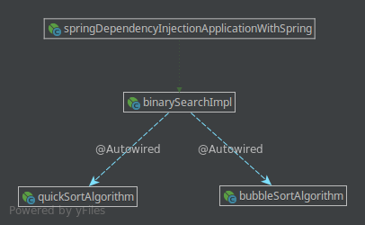

#### Module: Dependency Injection - DI
1. Package - withoutSpring
    * Here we create some classes without the use of Spring.  
    Use these classes to compare how we implement the same methods
      using Spring.
2. Package - withSpring
    * The classes are commented. 
    To start, go to the class: [SpringDIApplicationWithSpring](withSpring/SpringDIApplicationWithSpring.java) 
    then [BinarySearchImpl](withSpring/BinarySearchImpl.java) 
    * The scenario that we want to demonstrate is:   
    
    
#### Terms
1. Inversion of Control - IoC
    * "_... in traditional programming, the custom code that expresses the purpose of the program 
    calls into reusable libraries to take care of generic tasks, but with inversion of control, 
    it is the framework that calls into the custom, or task-specific, code._"  
1. Dependency Injection - DI
    * "_In software engineering, dependency injection is a technique whereby one object 
    (or static method) supplies the dependencies of another object. 
    A dependency is an object that can be used (a service). An injection is the passing of 
    a dependency to a dependent object (a client) that would use it._"
    
#### Source
* [1.4.1. Dependency Injection](https://docs.spring.io/spring/docs/current/spring-framework-reference/core.html#beans-factory-collaborators)
* [Kinbiko - Java: Spring Dependency Injection Patterns - The good, the bad, and the ugly](https://kinbiko.com/java/dependency-injection-patterns/)
* [Vojtech Ruzicka's Programming Blog - Field Dependency Injection Considered Harmful](https://www.vojtechruzicka.com/field-dependency-injection-considered-harmful/)
* [Baeldung - Intro to Inversion of Control and Dependency Injection with Spring](http://www.baeldung.com/inversion-control-and-dependency-injection-in-spring)
* [HowToDoInJava - Spring Inversion of Control (IoC) vs. Depedency Injection (DI)](https://howtodoinjava.com/spring/spring-core/inversion-of-control-ioc-and-dependency-injection-di-patterns-in-spring-framework-and-related-interview-questions/)
* [Wikipedia - Dependency injection](https://en.wikipedia.org/wiki/Dependency_injection)
* [Spring Doc. - Bean Factory x Application Context](https://docs.spring.io/spring/docs/current/spring-framework-reference/core.html#context-introduction-ctx-vs-beanfactory)
