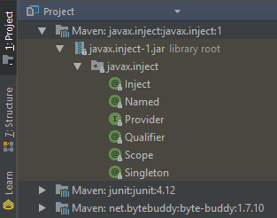

#### Module: Java CDI (Context and Dependecy Injection)
In this module, it is described how to use the Java CDI annotations with spring ioc container.
Note that CDI is a Java implementation, the Spring annotations have similar functionality, and depending on the situation, it its wanted to use Spring and CDI annotations.

* "_Contexts: The ability to bind the lifecycle and interactions of stateful components to well-defined but extensible lifecycle contexts._"
* "_Dependency injection: The ability to inject components into an application in a typesafe way, including the ability to choose at deployment time which implementation of a particular interface to inject._"

For this module, it is necessary to add a dependency in the pom.xml file.
* Maven GAV: javax.inject:javax.inject:1
    * 

#### Source
* [Oracle - The Java EE 6 Tutorial](https://docs.oracle.com/javaee/6/tutorial/doc/giwhl.html)
* [Caelum - Revisando a batalha Spring x Java EE em detalhes](http://blog.caelum.com.br/revisitando-a-batalha-spring-x-java-ee-em-detalhes/)