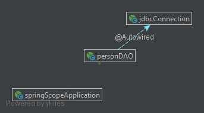

#### Module: Scope
* In this module it is demonstrated the basic configurations to implement a singleton or prototype bean.  
How those configurations affect the creation of objetcs using the autowired annotation.

#### Diagram

#### Source
* [1.5. Bean scopes](https://docs.spring.io/spring/docs/current/spring-framework-reference/core.html#beans-factory-scopes)
* [tutorialspoint - Spring - Bean Scopes](https://www.tutorialspoint.com/spring/spring_bean_scopes.htm)